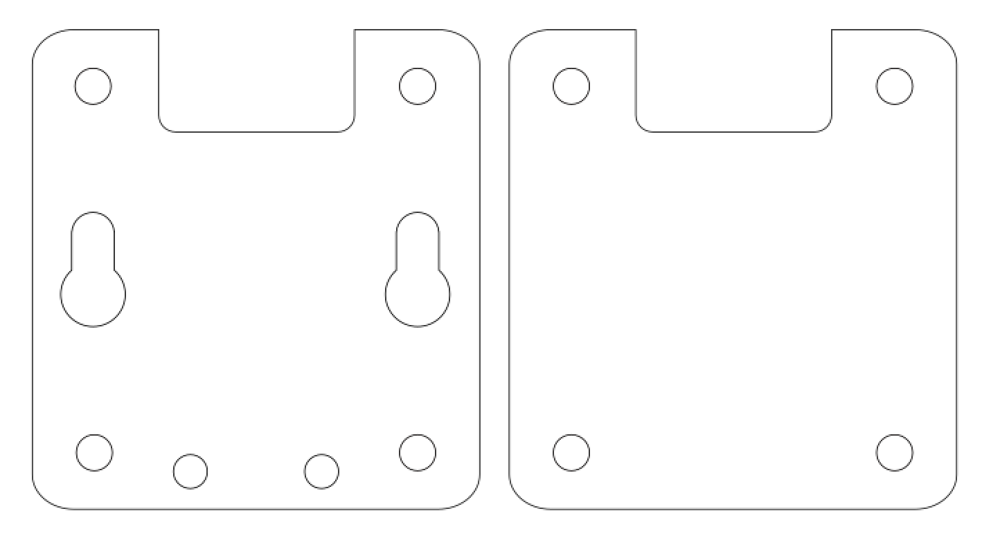

This is my first attempt at making a "case" for the CC2531 Zigbee Sniffer USB Stick. The cutout should make it compatible with CC2531s with and without external antennas.

This is currently a work in progress so your mileage may vary.

## Images

SVG for the case:  

## Assembly

- Laser cut the base and top plate out of ~3mm acrylic.
- Mount CC2531 to base plate with adhesive strips or hot melt glue. The holes in the base plate should accomodate the THT USB Connector, allowing the board to sit flush.
- Use M3 PCB Mounts to join the base and top plate.

## Licence

This project is licensed under the [Creative Commons CC BY-NC-SA 4.0](https://creativecommons.org/licenses/by-nc-sa/4.0/) licence.

You are free to share and adapt the code as required, however you *must* give appropriate credit and indicate what changes have been made. You must also distribute your adaptation under the same license. Commercial use is prohibited.

## Acknowledgements

Thanks to the [London Hackspace](https://london.hackspace.org.uk/) for use of the Laser Cutter.

